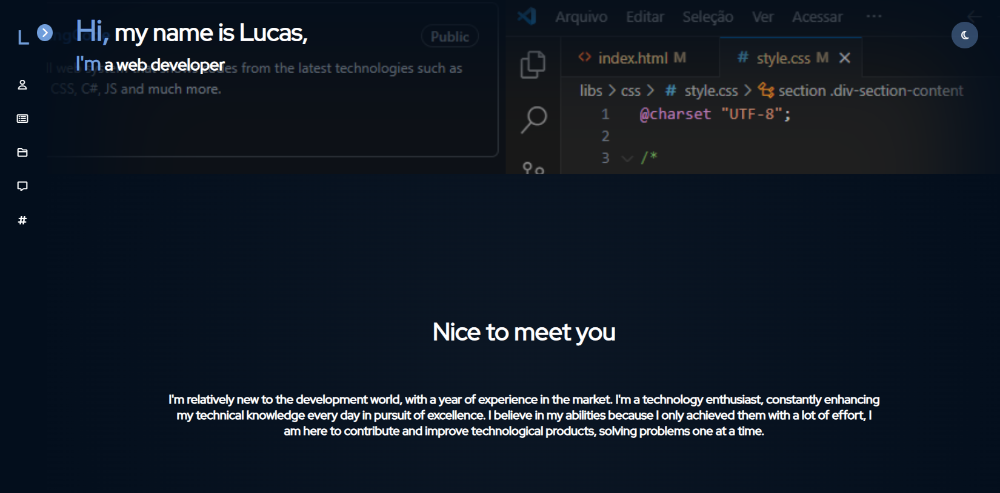

# Página do meu perfil - LukasO20
**(https://lukaso20.github.io){:target="_blank" rel="noopener noreferrer"}**

# Sobre
Aqui você irá conferir sobre uma página com resumos sobre minhas experiências profissionais, serviços e habilidades adquiridas ao longo de minha carreira. 
   

# Instruções de navegação

### Menu lateral
A página possui um visual focado em apresentação, para navegar entre suas seções, simplesmente clique nos ícones do menu lateral o qual ocorrerá o direcionamento para a seção correspondente. 

O menu também conta com expansões, se desejar expandir para ver mais detalhes de um determinado item, clique em;

**- Expandir o menu lateral**

 

**- Expandir redes socias**

 

### Links úteis
**Currículo:** Você pode acessar o meu currículo em (https://lukaso20.github.io/html/resume.html){:target="_blank" rel="noopener noreferrer"}

### Contato
**Mande-me um e-mail:** [lukinhaso2206@gmail.com](mailto:lukinhaso2206@gmail.com)